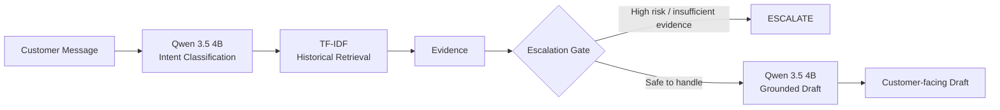

# Apple Support AI Agent

> **Evidence-grounded customer support automation — classify, retrieve, decide, and draft.**

[](https://www.python.org/)
[](https://ollama.com/)
[](https://ollama.com/)
[](https://scikit-learn.org/)
[](#evaluation)
[](#reproducibility)

An evidence-grounded customer support agent built for the **Hiver SDE Intern take-home assignment**.

The system is intentionally designed around a simple principle:

> **Automate only when the evidence is strong enough; otherwise, escalate.**

---

# 1. Quick Look — No Setup Required

Want to review the results without installing Ollama or running the local model?

The repository includes precomputed evaluation outputs under `data/evaluation/`, so the work can be inspected immediately:

- `data/evaluation/qwen_predictions.jsonl` — Qwen classification predictions
- `data/evaluation/agent_predictions.jsonl` — full agent outputs
- `data/evaluation/judge_predictions.jsonl` — LLM-as-judge results
- `data/evaluation/eval_set.jsonl` — the 150-example golden evaluation set

The README below explains the methodology, headline results, failure analysis, and judge audit. **No model setup is required to review the evidence.**

---

# 2. Clone → Run

The repository is designed to be runnable from a clean clone.

> **Local model note:** `qwen3.5:4b` is approximately **3.4 GB installed** in the validated Ollama environment. This is the only substantial model download required.


### Requirements

- Python 3.12+
- Ollama
- `qwen3.5:4b`

### Clone

```bash
git clone https://github.com/hithuyeager/apple-support-ai-agent.git
cd apple-support-ai-agent
```

### Create a fresh environment

```bash
python3 -m venv venv
source venv/bin/activate
```

### Install dependencies

```bash
pip install -r requirements.txt
```

### Make sure the local model is available

```bash
ollama list
```

You should see:

```text
qwen3.5:4b
```

If it is not installed:

```bash
ollama pull qwen3.5:4b
```

### Run the end-to-end sanity test

```bash
python -m scripts.test_agents
```

The test exercises:

```text
Customer message
      ↓
Intent classification
      ↓
Historical retrieval
      ↓
Escalation decision
      ↓
Evidence-grounded response
```

> **Fresh-clone verification:** this exact workflow was tested from a new Git clone with a new Python virtual environment. The repository successfully loaded the raw dataset, 1,347 customer messages, 828 support responses, installed its pinned dependencies, initialized Qwen, and completed the end-to-end agent test.

---

# 3. What I Built

Customer support automation is not just a text-generation problem.

A useful support agent needs to answer four questions:

| Question | System component |
|---|---|
| **What is the customer asking about?** | Qwen intent classifier |
| **What has support historically said about this?** | TF-IDF retrieval |
| **Should the system answer automatically?** | Escalation gate |
| **What can we safely tell the customer?** | Evidence-constrained Qwen generation |

The resulting pipeline is:



---

# 4. What Does "Good" Mean?

For a support brand, a response should not merely **sound helpful**.

I treated a good automated response as one that is:

1. **Relevant** — addresses the customer's actual problem.
2. **Grounded** — supported by historical support evidence.
3. **Helpful** — gives the customer a useful next step.
4. **Safe** — does not invent actions, policies, URLs, guarantees, or troubleshooting.
5. **Appropriately escalated** — hands off cases where automation is risky or unsupported.

This led to a deliberate design choice:

> **I optimized for evidence quality and safe automation, not maximum automation coverage.**

### What I deliberately did not build

The assignment does not require a large production platform, so I intentionally did **not** add complexity that would not improve the evaluation:

- No frontend or dashboard
- No database-backed application layer
- No production deployment
- No unnecessary vector database
- No elaborate agent/tool framework

The focus is the support decision pipeline and the evidence behind its behavior.

---

# 5. System Architecture

```text
                         ┌──────────────────────┐
                         │   Customer Message   │
                         └──────────┬───────────┘
                                    │
                                    ▼
                         ┌──────────────────────┐
                         │  Intent Classifier   │
                         │     Qwen 3.5 4B      │
                         └──────────┬───────────┘
                                    │
                             predicted intent
                                    │
                                    ▼
                         ┌──────────────────────┐
                         │   TF-IDF Retriever   │
                         │ Historical Support   │
                         │       Corpus         │
                         └──────────┬───────────┘
                                    │
                              ranked evidence
                                    │
                                    ▼
                         ┌──────────────────────┐
                         │   Escalation Gate    │
                         │                      │
                         │ • Security           │
                         │ • Billing            │
                         │ • Confidence         │
                         │ • Evidence           │
                         └──────────┬───────────┘
                              ┌─────┴─────┐
                              │           │
                           ESCALATE    AUTO-HANDLE
                              │           │
                              │           ▼
                              │   ┌──────────────────┐
                              │   │ Grounded Qwen     │
                              │   │ Response Draft    │
                              │   └────────┬─────────┘
                              │            │
                              ▼            ▼
                         Human review   Draft response
```

Implementation:

```text
src/
├── agent.py
├── classification/
│   ├── classifier.py
│   ├── baseline.py
│   └── qwen.py
├── retrival/
│   └── tfidf_retriever.py
├── generation/
│   └── generator.py
└── evaluation/
    └── escalation.py
```

---

# 6. Intent Taxonomy

I defined 10 small, support-oriented intents:

| Intent | Primary meaning |
|---|---|
| `software_os` | iOS/macOS updates, OS bugs, system behavior |
| `device_hardware` | Physical device or hardware problems |
| `connectivity` | Wi-Fi, Bluetooth, cellular/network connectivity |
| `account_auth` | Apple ID login, password, authentication |
| `apps_services` | Apple applications and services |
| `setup_activation` | Device setup and activation |
| `billing_purchase` | Purchases, charges, refunds, billing |
| `howto_feature` | How to use a feature/functionality |
| `privacy_security` | Unauthorized access, privacy, security concerns |
| `other` | Requests outside the defined categories |

### Classification boundary examples

The classifier follows the **primary goal**, not just keywords.

- Battery drain specifically caused by an OS update → `software_os`
- Wi-Fi problem explicitly attributed to an update → `software_os`
- Generic inability to connect to Wi-Fi → `connectivity`
- Apple ID issue during new-device setup → `setup_activation`
- Ordinary Apple ID login/password issue → `account_auth`
- Suspected unauthorized account access → `privacy_security`
- Feature usage question → `howto_feature`
- Activation server failure → `setup_activation`
- Physical device damage → `device_hardware`

---

# 7. Historical Support Corpus

The project uses the AppleSupport portion of the **Customer Support on Twitter** dataset.

The local data used by the pipeline contains:

```text
30 conversations
1,347 customer messages
828 Apple Support messages
11,153 lines in the raw conversation file
```

The source is noisy.

In particular, the raw conversation structure can contain unrelated customer issues and non-chronological relationships. Therefore, I deliberately **do not assume that every adjacent customer/support message is a valid resolution pair**.

Instead:

> **Historical Apple Support messages are treated as a support knowledge corpus.**

The retriever can still expose the historical customer context associated with a support response, but the generator treats the **Apple Support response as the resolution source**.

This was an important design decision because blindly treating noisy conversation ordering as ground truth would make the system appear more grounded than it really is.

---

# 8. Retrieval

The first implementation used TF-IDF because it is:

- deterministic
- lightweight
- locally runnable
- easy to inspect
- fast enough for a take-home prototype

The retriever uses a two-stage process.

### Stage 1 — Historical customer similarity

The current customer message is compared against historical customer messages to find relevant historical context.

### Stage 2 — Support-response ranking

Historical Apple Support responses are then ranked against the current query.

The final score is:

```text
final_score =
    0.8 × support_response_similarity
  + 0.2 × customer_similarity
```

Duplicate support responses are removed before the final evidence list is returned.

Each evidence item contains:

```text
retrieval score
historical customer message
historical Apple Support response
```

This makes the retrieval step inspectable rather than hiding evidence inside a model prompt.

---

# 9. Evidence-Grounded Generation

The generator uses local:

```text
qwen3.5:4b
```

through Ollama.

The generation prompt explicitly instructs the model to use **only the supplied historical evidence**.

It is told not to:

- invent troubleshooting steps
- invent URLs
- invent policies or guarantees
- claim actions were performed when they were not
- use unsupported general knowledge

If the retrieved evidence is insufficient, the generator can return:

```text
ESCALATE: insufficient historical evidence
```

The agent catches this marker and converts it into an escalation instead of returning an unsupported answer.

### Example

For:

> "My iPhone cannot activate. The activation server is unavailable."

the system classified the message as:

```text
Intent: setup_activation
Confidence: 0.95
```

The top retrieved historical evidence included:

> A historical customer reported an activation server being temporarily unavailable.

and Apple Support responded with activation troubleshooting steps and a request to DM if the issue continued.

The generated draft followed that historical resolution rather than inventing a new procedure.

---

# 10. Escalation Policy

The escalation layer is deliberately simple and auditable.

### High-risk intents

```text
privacy_security
billing_purchase
```

These are treated as high risk because unsupported automated guidance can be particularly costly for security incidents, account compromise, charges, and refunds.

### Security overrides

Security-related phrases can trigger high-risk escalation even if the classifier predicts another intent.

Examples include signals such as:

```text
someone got into my account
unauthorized access
unknown login/device
account compromised
someone changed my password
```

### Other escalation conditions

The system can escalate when:

- classifier confidence is below the configured threshold
- no evidence is available
- retrieved evidence is too weak
- the generator explicitly reports insufficient evidence

The philosophy is:

```text
Unsupported answer
      ↓
     NO

Insufficient evidence
      ↓
   ESCALATE
```

---

# 11. Golden Evaluation Set

The assignment requires **150–250 hand-labelled examples**.

I created a deterministic 150-example golden set.

The examples were sampled using a fixed seed and round-robin selection across the available conversations, then manually labeled according to the intent taxonomy and boundary rules above.

The final artifact is:

```text
data/evaluation/eval_set.jsonl
```

The fixed sampling procedure makes later experiments comparable because the evaluation population does not change between runs.

---

# 12. Classification Evaluation

Two baselines were implemented:

### Trivial baseline

A majority-class classifier.

### Simple baseline

A lightweight rule/keyword classifier.

Results on the 150-example golden set:

| Model | Accuracy |
|---|---:|
| Majority baseline | 48.67% |
| Rule-based baseline | 46.67% |
| **Qwen 3.5 4B** | **83.33%** |

Qwen achieved:

```text
+34.66 percentage points
```

over the majority baseline and:

```text
+36.66 percentage points
```

over the rule-based baseline.

Qwen Macro-F1:

```text
76.64%
```

The gap between accuracy and Macro-F1 also shows why accuracy alone is insufficient: smaller intents have materially weaker performance.

---

# 13. Full Agent Evaluation

The complete pipeline was evaluated on all 150 examples.

```text
Examples           : 150
Successful runs    : 150
Failed runs        : 0
Classification acc : 82.67%
Auto-handled       : 138
Escalated          : 12
Auto-handle rate   : 92.00%
```

The complete evaluation artifacts are stored under:

```text
data/evaluation/
```

including model predictions and judge inputs/outputs.

---

# 14. What Is Misleading About My Headline Number?

## 92% auto-handle rate

This is the number I would **not** put on a slide without qualification.

A 92% auto-handle rate means that 92% of the evaluated requests passed the current escalation gate.

It does **not** mean:

- 92% of responses are correct
- 92% of responses are grounded
- 92% of customers would be satisfied
- 92% of retrieved evidence is relevant
- 92% of cases are safe to resolve automatically

The evaluation exposed why.

The LLM judge gave:

```text
Evidence grounded : 13 / 30 (43.3%)
Overall pass       : 6 / 30  (20.0%)
```

Those numbers are not perfect ground truth either, but they demonstrate the central problem:

> **Passing the escalation gate is not the same thing as producing a high-quality support answer.**

Therefore, the 92% figure is best interpreted as **automation coverage**, not support quality.

---

# 15. LLM-as-Judge Evaluation

A 30-case judge set was deliberately constructed to contain difficult and informative examples, including:

- classification errors
- escalated cases
- strong retrieval cases
- weak retrieval cases

The judge scored:

- relevance
- groundedness
- helpfulness
- evidence quality
- escalation appropriateness
- evidence grounding
- overall pass
- critical failure

Results:

| Metric | Result |
|---|---:|
| Relevance | 3.27 / 5 |
| Groundedness | 2.80 / 5 |
| Helpfulness | 2.07 / 5 |
| Evidence quality | 2.30 / 5 |
| Escalation appropriateness | 3.47 / 5 |
| Evidence grounded | 13 / 30 |
| Overall pass | 6 / 30 |
| Critical failures | 20 / 30 |

The most important finding was not the absolute judge score.

It was that **retrieval quality became the bottleneck for grounded generation**.

---

# 16. Does the Judge Agree With a Human?

I did not treat the LLM judge as ground truth.

A 20-case **manual second-pass review** was used to audit the judge's evidence-grounding labels.

Results:

```text
Manual TRUE       : 11
Manual FALSE      : 9
Judge TRUE        : 9
Judge FALSE       : 11

Raw agreement     : 60.0%
Cohen's kappa     : 0.208
```

This indicates weak agreement.

The disagreement analysis showed that the judge sometimes conflated:

- evidence relevance
- response quality
- escalation appropriateness

In some cases, the historical evidence directly supported the generated response, but the judge marked it as unrelated.

Therefore:

> **LLM-judge results are treated as diagnostic evidence, not ground truth.**

This limitation is intentionally reported rather than hidden.

---

# 17. Top 5 Failure Modes

## 1. Lexical retrieval can retrieve the wrong resolution

TF-IDF can identify shared words without understanding whether the historical resolution actually solves the same problem.

For example, an update/Wi-Fi complaint could retrieve an unrelated Apple Support response about iPad features because of overlapping vocabulary.

**Hypothesis:** lexical similarity is insufficient for operational support retrieval.

**Next step:** semantic retrieval followed by a stronger reranker.

---

## 22. High-confidence classification errors

Some incorrect classifications were produced with confidence as high as:

```text
0.95
```

This means the raw confidence value cannot safely be interpreted as calibrated probability.

**Hypothesis:** the classifier is confident about ambiguous lexical patterns without having calibrated uncertainty.

**Next step:** confidence calibration and an uncertainty-aware validation set.

---

## 22. Weak or sparse historical evidence

Some legitimate customer questions simply do not have a sufficiently relevant historical resolution in the available corpus.

In these cases, generic model knowledge could make the response sound excellent while violating the grounding requirement.

**Hypothesis:** the support corpus does not provide sufficient coverage for every intent.

**Next step:** explicit evidence sufficiency/entailment checking before generation.

---

## 22. Noisy conversation structure

The source dataset contains unrelated issues and non-chronological relationships.

Treating raw adjacency as a customer → resolution pair can create false evidence relationships.

**Hypothesis:** conversation-level structure in this dataset is too noisy to serve as a clean knowledge graph.

**Next step:** stronger historical interaction cleaning and resolution extraction.

---

## 22. Retrieval score is not a reliable grounding threshold

I investigated whether the TF-IDF score could be used as a simple cutoff for automatic handling.

It could not.

On the 30-case judge subset, grounded and ungrounded examples had overlapping retrieval-score distributions. Raising the threshold aggressively would have rejected many usable cases while still not providing a reliable grounding guarantee.

For example, among the inspected judge cases:

```text
Highest-scoring ungrounded examples
120 : 0.5435
146 : 0.5372
56  : 0.5335
99  : 0.5231

Lowest-scoring grounded examples
51  : 0.4646
38  : 0.4784
114 : 0.4887
77  : 0.4970
```

**Conclusion:** a retrieval similarity score is a ranking signal, not an evidence-validity proof.

---

# 18. Key Engineering Lessons

### Retrieval is the real bottleneck

The generation model can produce fluent responses. The harder problem is supplying it with evidence that actually supports those responses.

### Confidence is not calibration

A `0.95` classifier confidence can still correspond to an incorrect prediction.

### Automation coverage can hide quality problems

A system can auto-handle almost everything and still produce poor support if its evidence is weak.

### Simple systems can be valuable when they are inspectable

TF-IDF and a rule-based escalation gate make it possible to inspect why the system behaved as it did.

### Evaluation should challenge the system

The evaluation was designed not only to report a headline accuracy number, but to expose retrieval, grounding, escalation, and judging weaknesses.

---

# 19. What I Would Do With One More Week

I would **not** spend the week trying to increase the 92% auto-handle number.

I would improve evidence quality in this order:

### 1. Semantic retrieval

Replace or augment TF-IDF with embedding-based retrieval to capture meaning rather than only shared terms.

### 22. Cross-encoder / LLM reranking

Use a stronger reranker over the top retrieved candidates to determine which historical support resolution actually addresses the current issue.

### 22. Evidence entailment gate

Before generation, explicitly test:

```text
Does the retrieved support response
actually support the proposed answer?
```

If not:

```text
ESCALATE
```

### 22. Calibrate classifier confidence

Use held-out examples to calibrate confidence and establish intent-specific thresholds.

### 22. Improve the evaluation set

Expand difficult boundary cases and create more examples specifically targeting:

- retrieval confusion
- ambiguous intents
- unsupported questions
- security/billing risk
- misleadingly high similarity

The goal would be to improve **safe resolution quality**, not simply automation coverage.

---

# 20. Reproducibility

A clean-clone validation was performed before finalizing the repository.

The validation was performed from a separate fresh Git clone, using a new Python virtual environment. This verified the repository contents, dependency installation, local Ollama model availability, and the end-to-end `python -m scripts.test_agents` path.

The validation used:

```text
fresh Git clone
        ↓
new Python virtual environment
        ↓
pip install -r requirements.txt
        ↓
local qwen3.5:4b
        ↓
python -m scripts.test_agents
```

Verified repository data:

```text
Raw conversation file       : 11,153 lines
Customer message corpus     : 1,347 messages
Support response corpus     : 828 messages
```

The end-to-end sanity test successfully performed:

```text
classification
retrieval
escalation decision
generation
```

with no runtime failure.

---

# 21. Repository Structure

```text
apple-support-ai-agent/
│
├── README.md
├── requirements.txt
├── .env.example
├── .gitignore
│
├── data/
│   ├── raw/
│   │   └── apple_convos.txt
│   │
│   ├── processed/
│   │   ├── customer_messages.jsonl
│   │   └── support_responses.jsonl
│   │
│   └── evaluation/
│       ├── eval_candidates.jsonl
│       ├── eval_set.jsonl
│       ├── qwen_predictions.jsonl
│       ├── agent_predictions.jsonl
│       ├── judge_set.jsonl
│       ├── judge_predictions.jsonl
│       └── human_review.csv
│
├── src/
│   ├── agent.py
│   │
│   ├── classification/
│   │   ├── classifier.py
│   │   ├── baseline.py
│   │   └── qwen.py
│   │
│   ├── retrival/
│   │   └── tfidf_retriever.py
│   │
│   ├── generation/
│   │   └── generator.py
│   │
│   └── evaluation/
│       └── escalation.py
│
└── scripts/
    ├── prepare_dataset.py
    ├── prepare_support_corpus.py
    ├── evaluate_baseline.py
    ├── evaluate_qwen.py
    ├── evaluate_agent.py
    ├── prepare_judge_set.py
    ├── judge_agent.py
    ├── summarize_judge.py
    ├── prepare_human_review.py
    ├── calculate_agreement.py
    └── test_agents.py
```

---

# 22. Final Takeaway

This project is intentionally not presented as a perfect autonomous support agent.

The stronger claim is:

> **I built a complete, reproducible support automation pipeline, measured it against trivial and simple baselines, created a hand-labelled golden set, audited an LLM judge against manual review, and used the resulting failures to identify retrieval and evidence quality as the main next engineering problem.**

The system demonstrates the full loop:

```text
UNDERSTAND
    ↓
RETRIEVE
    ↓
ASSESS RISK
    ↓
GROUND
    ↓
ANSWER OR ESCALATE
    ↓
MEASURE FAILURE
```

**Proof over polish. Evidence over fluency. Safe automation over maximum automation.**
